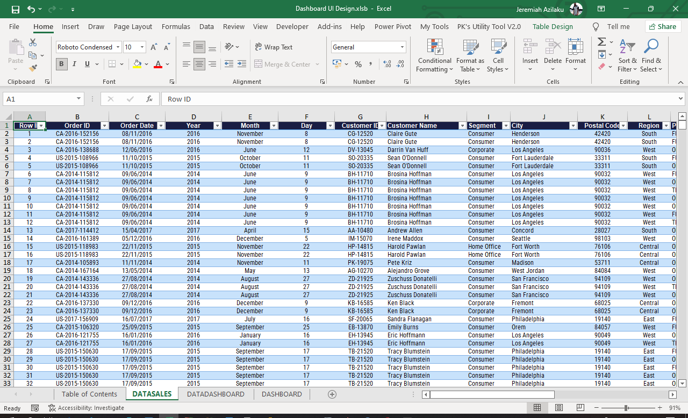
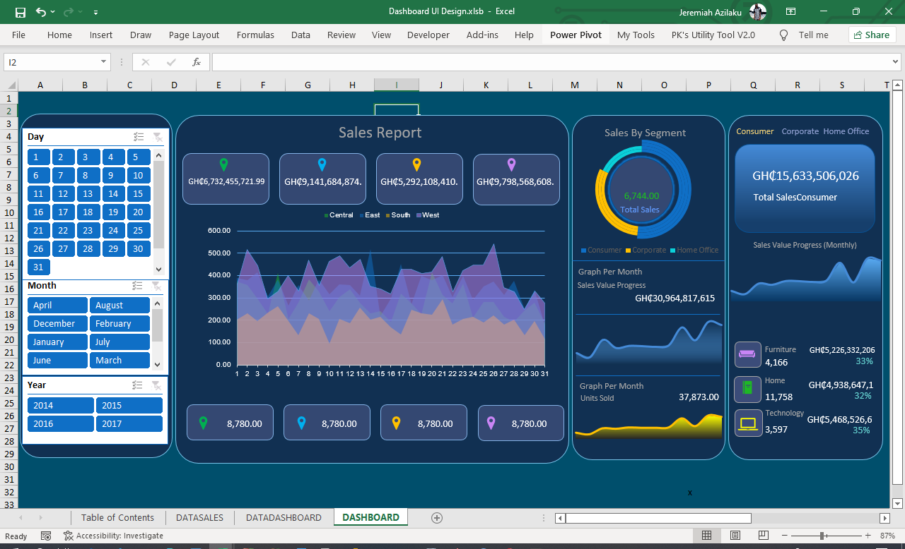
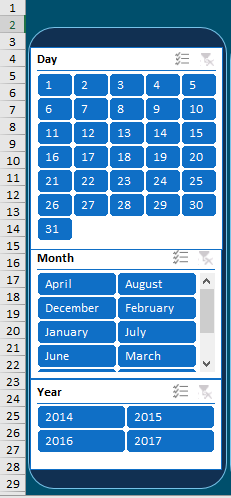
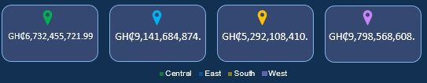
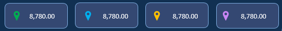
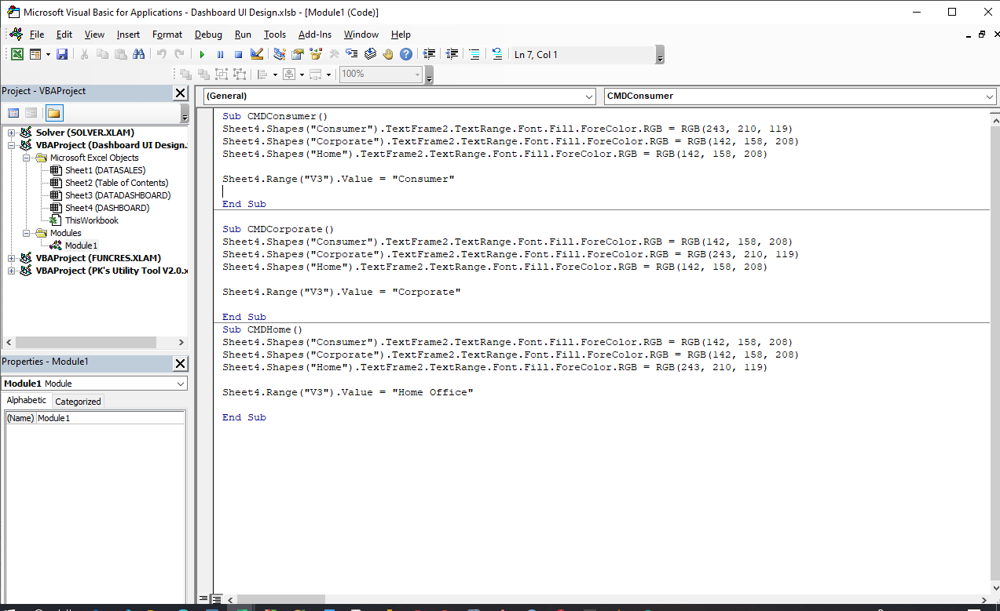

# Modern-UI-Dashboard
+ This dashboard helps employers and colleagues get insights from data easily without knowing much about excel and its workings. It is proven that human learn more with visualizations that normal form of learning.

+ The data collected is a recording of sales made from 2014 - 2017 by a mall.
+ It contains 9995 records and 21 columns in total.
+ The columns are Row ID, Order ID, Year, Month, Day, Customer ID, Customer Name, Segment, City, Postal Code, Region, Product ID, Category, Sub-Category, Product Name, Product Price, Quantity, % Discount, Discount and Total Sales.

### Sales Report

Lets us look at the various segments of the dashboard and how they were created.

### Slicers
<!--  -->
<!--  -->

+ The slicers are use to filter the period of transaction you want the report performed on, according to day, month and year

### Sales Report
+ The sales report represents the total units sold and the total sales of each region. Being the Central, East, South and West respectively.
+ Derived using the pivot table from the dataDashboard sheet.
 

+ Units sold by each region.  

### Segments
+ This displays the total sales made all year and the total amount of units sold.  

+ Few lines of VBA codes is written to to help filter the segments to display the current and how much each segment made. Sub sections included.

####  You can download the file to explore it more.

